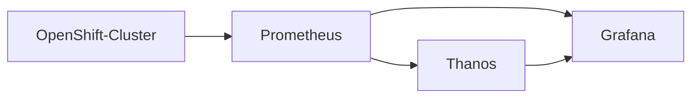
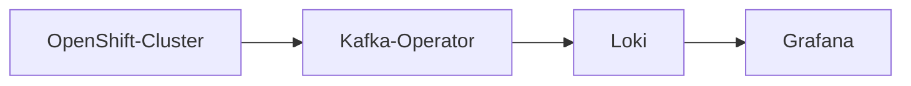

# 2021 Spring Co-op Project
**Title**: Expansion of Storage Monitoring in the Operate First Environment \
**Co-op**: Bryan Montalvan \
**School**: University of Massachussetts Lowell 

## My Project Proposal
My project for this spring period is to expand the way we currently monitor storage metrics in the [Operate First Enviroment](https://www.operate-first.cloud/). This will be done by creating a grafana dashboard which will visualize storage data by cluster and its respective namespace.

Whether you are a user or administrator, having the ability to view your cluster's storage metrics and logs is a great asset to understand
the health of your application's deployment. Knowing if your [PV](https://kubernetes.io/docs/concepts/storage/persistent-volumes/) is about to max out on resources is crucial on knowing when to request more storage. Another example is finding out what is using the most resources on your namespace. 

In conjuction to this project idea I also have a complimentary project idea which is to create a `Predictable Consumption Model` witch can predict when a PV will be full. And could forecast other storage reated metrics/occurences. This idea can potentially involve alerting, more research will be done on this idea down the line.

## How will this be done?
### Storage Dashboard:
First I will check the data we pull from Prometheus checking any labels/queries which are storage related and get an understanding of what type of metrics
I have to my disposal. Afterwards I'll only take the metrics that users would deem useful, and the planning phase begins.

**Note: When creating data visualization its always important to follow these guidelines**
- Make the metrics/data make sense
- Each time a metric is pulled, it acquires a cost so pull only what you need
- Understand your intended audience

Once I have a starting idea as to what should be visualized I'll use the visulization tool, [Grafana](https://grafana.com/grafana/dashboards/), to create visulizations which drive my projects intentions. Currently I will expand our **Storage Cluster Overview** dashboard which is meant to have a high level view of each cluster and its storage data. I will also create a new folder which will house a user specific dashboard so users can know more about how their projects are doing in our clusters

### Metrics

### Logs

### Predictable Consumption Model (PCM):
Creating a Predictable Consumption Model will be the second task of this whole project, with my current vision in my mind.
I will fetch logs from both `Prometheus(for metrics)` and `Loki(for logs)`, to show users when they may be close to running out of storage
and at the same time letting users know if they're requesting too much data(logs).

This complementary idea is in its rough draft phase and will be focused on when the `Storage Dashboard` is closer to completion.

## Note:
If you are unfamilar with Operate First, please take a look at a simple introductary [doc](about-opf.md) to better understand what the initative is and how
the monitor infrastructure works.
