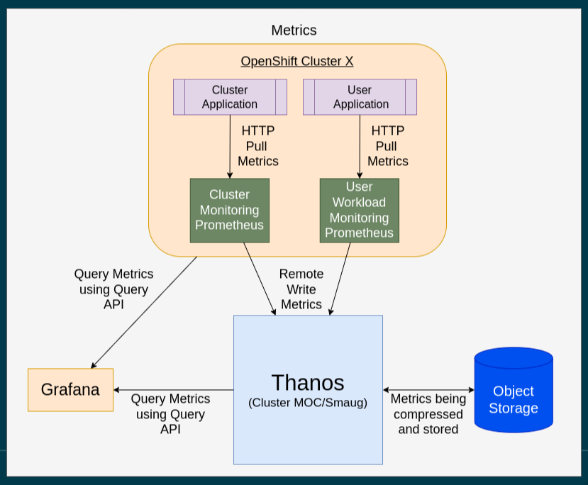

# What you need to know about Operate First

[Operate First](https://www.operate-first.cloud/) is an open-source initative with the goal of bringing software under development to a production cloud. It is a way of connecting all stakeholders of building, deploying, and operating software; similar to an open source community.

The [Operate First Enviroment](https://github.com/operate-first/apps) is hybrid cloud environment with the purpose of having projects bring their software to a production cloud enviroment. 

(Please check out the following link for more detailed a better explanation [here](https://youtu.be/XpFeNEzlh70))

### What exactly is Operate First?
- Operate First manages OpenShift Clusters
- Uses GitOps workflow to allow quick onboarding for projects(namespaces)
- Allows Data Scientist to focus more on their work, than their enviroment 

| Buzz Words  | Definition |
| ------------- | ------------- |
| [MOC](https://massopen.cloud/)  | *Mass Open Cloud*, Is an environment that consists of two **OpenShift clusters**, one containing Infra Cluster and the Smaug Cluster  |
| [Infra Cluster](https://www.operate-first.cloud/apps/content/README.html)  | A management cluster, small in size, and houses both **ArgoCD** and **ACM** deployments.  |
| [Smaug Cluster](https://www.operate-first.cloud/apps/content/README.html)  | Worker cluster, larger in size, contains user workloads and our own managed deployments (One of which is a [Open Data Hub](https://opendatahub.io/) instance) | 
| [ArgoCD](https://argo-cd.readthedocs.io/en/stable/)  | Deploys applications in destinations, and these destiniations are clusters |
| [ACM](https://www.redhat.com/en/technologies/management/advanced-cluster-management) | *Advanced Cluster Management*, deploys and manages clusters | 
| [Prometheus](https://prometheus.io/docs/introduction/overview/) | A simple [TSBD](https://www.influxdata.com/time-series-database/) which collects metrics using HTTP pull requests| 
| [Thanos](https://github.com/thanos-io/thanos) | An extension of prometheus, which stores metrics at a longer term than Prometheus |
| [Loki](https://github.com/grafana/loki#loki-like-prometheus-but-for-logs) | A log aggregation system inspired by Prometheus|
| [Grafana](https://grafana.com/oss/grafana/) | Visualization tool used for visualizing metrics and logs, in our instance queried from Prometheus, Thanos, and or Loki|

## Operate First Monitoring Architecture

### Metrics Infrastructure Overview

### Explanation:
Each cluster has two `Prometheus instances` which query metrics to both `Thanos` and `Grafana`. The `Cluster Monitoring Instance` sends metrics
to both Thanos and Grafana, but also sends metrics directly to Grafana for direct visualzation of the Cluster's current state. On the other hand the `User Workload Monitoring` instance sends metrics to thanos since its present metrics. Thanos sends metrics to both Grafana and stores the metrics into an Object Storage.

### Logs Infrastructure Overview

### Explanation
Each cluster has a [Kafka Producer](https://docs.confluent.io/platform/current/clients/producer.html#:~:text=Concepts,the%20leader%20of%20that%20partition.), which is a cluster logging operator, which fetches logs from each container. The instance of [Kafka](https://kafka.apache.org/) that is deployed on the `MOC/Smaug cluster` absorbs those stats and then `Loki` takes those logs and sends those logs to both `Grafana` and its very own Object store.

## Resources:
OPF Docs: https://www.operate-first.cloud/apps/content/README.html \
Original Issue: https://github.com/operate-first/SRE/issues/445
